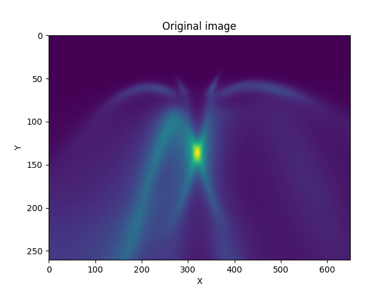
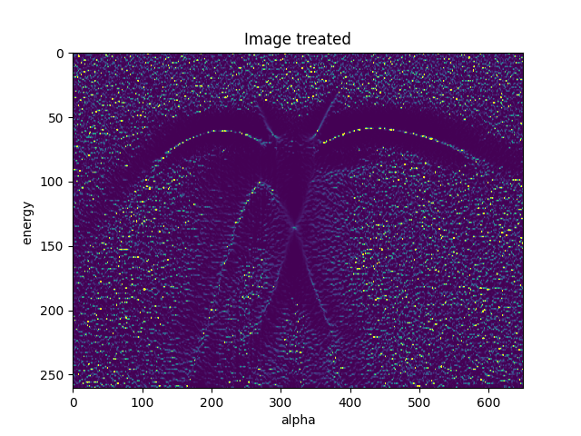

# tracking-maxima

Based on the following article:  
https://aip.scitation.org/doi/abs/10.1063/1.3585113

I share the program I build to treated my ARPES measurements, but you can use it for any measurements.

I implemented the formula for 1D and 2D spectrum.  
Keep in mind, we have to use different formula if the image has equivalent or inequivalente independent variables.

I show you an exemple of what we can expect.

I took an ARPES image 
[Original image ](https://github.com/b5419/tracking-maxima/blob/main/original_img.png)  
  
  
That what a obtained with the best amplitude
[Image_treated](https://github.com/b5419/tracking-maxima/blob/main/img_treated.png)  
  
  
We could applied a filter on the image to reduce the nose.  
I applied an Savitzky-golay filter, (you will find the filter on savitzky-golay.py file), and the apply the tracking maxima program.
The image obtain is the following: [Image_treated_filtered](https://github.com/b5419/tracking-maxima/blob/main/img_treated_filtered.png) 
    

The program used to generate the images is curvatures_example.py

